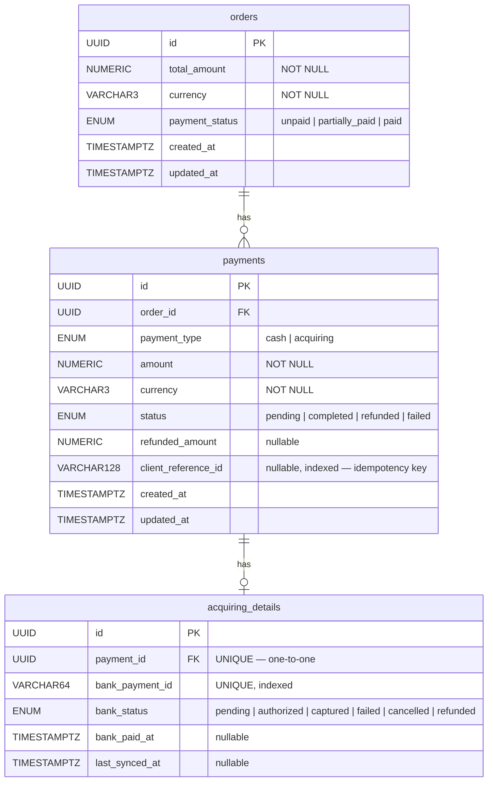

# Payment Order Service

Сервис управления платежами по заказам: депозиты (наличные и эквайринг),
частичные/полные возвраты, синхронизация статусов с банковским API.

---

## Быстрый старт

**Требования:** Docker, Docker Compose

```bash
git clone https://github.com/Gricana/payment_order_service
cd payment-order-service
cp .env.example .env
docker-compose up --build
```

При старте автоматически применяются миграции и создаются 3 тестовых заказа.


| URL                          |            |
| ---------------------------- | ---------- |
| `http://localhost:8000/docs` | Swagger UI |


**.env.example:**

```env
DATABASE_URL=postgresql+asyncpg://payments:payments@db:5432/payments
BANK_API_BASE_URL=http://bank-api:8000
BANK_API_MODE=fake
DB_NAME=payments
DB_USER=payments
DB_PASSWORD=payments
```

`BANK_API_MODE=fake` — не делает реальных HTTP-запросов к банку,
используется для локальной разработки и тестов.

### Тесты

```bash
pytest
```

---

## Схема БД




---

## Архитектура

Проект построен на принципах **Clean Architecture**. Зависимости направлены строго
внутрь — каждый слой знает только о слоях внутри себя.

```
┌──────────────────────────────────────────────────┐
│                  presentation                    │
│                FastAPI · Pydantic                │
└─────────────────────┬────────────────────────────┘
                      │
┌──────────────────────────────────────────────────┐
│                  application                     │
│                Use Cases · DTO                   │
│                                                  │
│  CreatePaymentUseCase                            │
│  RefundPaymentUseCase                            │
│  SyncAcquiringStatusUseCase                      │
└─────────────────────┬────────────────────────────┘
                      │
┌──────────────────────────────────────────────────┐
│                    domain                        │
│           Entities · Value Objects               │
│                                                  │
│  Order                                           │
│  Payment                                         │
│  Money                                           │
└─────────────────────|────────────────────────────┘
                      |
┌─────────────────────┴────────────────────────────┐
│                infrastructure                    │
│         Адаптеры реализуют порты домена          │
│                                                  │
│  SqlAlchemyOrderRepository                       │
│  FakeBankApiClient                               │
│  CashProcessor · AcquiringProcessor              │          
└──────────────────────────────────────────────────┘
```

